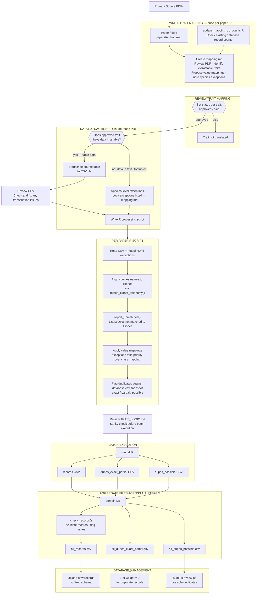

# Fireveg Trait Import Pipeline

A reproducible pipeline for extracting plant fire-response traits from published literature and importing them into the fireveg PostgreSQL database (`litrev` schema).



For the full colour-coded version open `workflow.html` in a browser.

---

## What this does

Plant fire-response traits (resprouting strategy, regenerative organ, seedbank type, juvenile period, etc.) are extracted from scientific papers, standardised to the fireveg trait vocabulary, and prepared for import into a central PostgreSQL database. The pipeline handles taxonomy alignment, duplicate detection, and quality validation across all source papers.

---

## Repository structure

```
fireveg-db-adele/
├── README.md                         # this file
├── PIPELINE.md                       # step-by-step pipeline documentation
├── TRAIT_LOGIC.md                    # interpretation record — how each trait was mapped across papers
├── workflow.html                     # visual pipeline diagram (open in browser)
├── funx.R                            # shared R functions: match_bionet_taxonomy(), flag_duplicates(), check_records()
├── combine.R                         # aggregates all paper outputs; runs validation; writes upload files
├── run_all.R                         # batch runner — sources all paper R scripts sequentially
├── database.csv                      # snapshot export of the litrev database (for duplicate detection)
├── all_records.csv                   # → ready for database upload
├── all_dupes_exact_partial.csv       # → records to retire (set weight = 0)
├── all_dupes_possible.csv            # → possible duplicates for manual review
├── data/                             # shared reference data
│   ├── bionet_species_with_apcalign_suggested_name.csv   # Bionet species list (required by funx.R)
│   ├── fireveg-trait-records-model.xlsx                  # authoritative trait vocabulary
│   ├── dharawal/                     # source data for Keith 1991
│   ├── glenorie_brisbane_waters/     # source data for Benson 1985
│   └── torrington/                   # source data for Clarke Fulloon 1999
└── papers/                           # one folder per source paper
    ├── completed_manually/           # papers processed before the pipeline was formalised
    └── Author Year/
        ├── mapping.md                # trait extraction spec and approval record
        ├── author_year_data.csv      # raw data transcribed from the paper
        ├── author_year.R             # processing script
        ├── author_year_records.csv           # new trait records (output)
        ├── author_year_dupes_exact_partial.csv  # confirmed duplicates (output)
        └── author_year_dupes_possible.csv       # possible duplicates (output)
```

---

## How to run

### Prerequisites
- R (≥ 4.1)
- Packages: `tidyverse`, `APCalign`
- Database credentials in `secrets/Renviron.local` (not committed)

### Steps

1. **Refresh `database.csv`** — export a current snapshot from the litrev database using the queries in the pipeline documentation. This is used for duplicate detection.

2. **Run all paper scripts**
   ```r
   source('run_all.R')
   ```
   This runs every paper's R script sequentially and logs errors. Set `RUN_UNPROCESSED_ONLY <- TRUE` to skip papers that already have a records CSV.

3. **Review `TRAIT_LOGIC.md`** — check interpretation consistency across papers before aggregating.

4. **Aggregate outputs**
   ```r
   source('combine.R')
   ```
   This validates each paper's records (`check_records()`), binds them all together, and writes the three upload-ready files.

5. **Database import** — hand `all_records.csv` and `all_dupes_exact_partial.csv` to the database administrator. New records are uploaded; duplicate records have `weight` set to 0.

---

## Adding a new paper

See `PIPELINE.md` for the full step-by-step process. In brief:

1. Create `papers/Author Year/` folder
2. Run `update_mapping_db_counts.R` to check existing records for this source
3. Create `mapping.md` — review the PDF, propose value mappings, note species exceptions
4. Set trait status to `approved` or `skip` in `mapping.md`
5. Transcribe source data to CSV; review against paper
6. Generate R processing script
7. Review `TRAIT_LOGIC.md` for interpretation consistency
8. Run `run_all.R`, then `combine.R`

---

## Key files explained

| File | Purpose |
|---|---|
| `funx.R` | Core functions used by all scripts — taxonomy matching, duplicate flagging, record validation |
| `combine.R` | Aggregates all `*_records.csv` files; runs `check_records()` per paper; writes `all_records.csv` |
| `run_all.R` | Sources all paper scripts in one go; catches and logs errors |
| `database.csv` | Database snapshot used by `flag_duplicates()` — refresh before running |
| `PIPELINE.md` | Full pipeline documentation including script template and conventions |
| `TRAIT_LOGIC.md` | Cross-paper record of how trait values were mapped — intended for expert review before import |
| `workflow.html` | Visual diagram of the pipeline — open in any browser |
