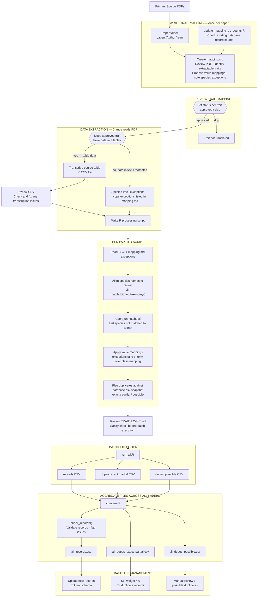

# Fireveg Trait Import Pipeline

A reproducible pipeline for extracting plant fire-response traits from published literature and importing them into the fireveg PostgreSQL database (`litrev` schema).



For the full colour-coded version open `workflow.html` in a browser.

---

## What this does

Plant fire-response traits (resprouting strategy, regenerative organ, seedbank type, juvenile period, etc.) are extracted from scientific papers, standardised to the fireveg trait vocabulary, and prepared for import into a central PostgreSQL database. The pipeline handles taxonomy alignment, duplicate detection, and quality validation across all source papers.

---

## Repository structure

```
fireveg-db-adele/
├── README.md                         # this file
├── PIPELINE.md                       # step-by-step pipeline documentation
├── TRAIT_LOGIC.md                    # interpretation record — mapping decisions across all papers
├── workflow.html                     # full colour pipeline diagram (open in browser)
├── R/                                # shared R scripts
│   ├── funx.R                        # core functions: taxonomy matching, duplicate flagging, validation
│   ├── combine.R                     # aggregates paper outputs; validates; writes to outputs/
│   ├── run_all.R                     # batch runner — sources all paper scripts sequentially
│   ├── export_database.R             # exports database snapshot to data/database.csv
│   └── update_mapping_db_counts.R    # inserts DB record counts into mapping.md headers
├── data/
│   ├── bionet_species_with_apcalign_suggested_name.csv   # Bionet species list (required by funx.R)
│   └── database.csv                  # DB snapshot for duplicate detection — not committed, run export_database.R
├── outputs/                          # generated by combine.R — not committed
│   ├── all_records.csv               # → ready for database upload
│   ├── all_dupes_exact_partial.csv   # → records to retire (set weight = 0)
│   └── all_dupes_possible.csv        # → possible duplicates for manual review
└── papers/                           # one folder per source paper
    ├── completed_manually/           # papers processed before the pipeline was formalised
    └── Author Year/
        ├── mapping.md                # trait extraction spec and approval record
        ├── author_year_data.csv      # raw data transcribed from the paper
        ├── author_year.R             # processing script
        ├── author_year_records.csv           # new trait records (output)
        ├── author_year_dupes_exact_partial.csv  # confirmed duplicates (output)
        └── author_year_dupes_possible.csv       # possible duplicates (output)
```

---

## How to run

### Prerequisites
- R (≥ 4.1)
- Packages: `tidyverse`, `APCalign`
- Database credentials in `secrets/Renviron.local` (not committed)

### Steps

1. **Export `database.csv`** — run `export_database.R` to pull a current snapshot from the litrev PostgreSQL database. Requires credentials in `secrets/Renviron.local`. This file is not committed to the repository as it contains unpublished data.

2. **Review `TRAIT_LOGIC.md`** — check interpretation consistency across all papers before running scripts.

3. **Run all paper scripts**
   ```r
   source('run_all.R')
   ```
   This runs every paper's R script sequentially and logs errors. Set `RUN_UNPROCESSED_ONLY <- TRUE` to skip papers that already have a records CSV.

4. **Aggregate outputs**
   ```r
   source('combine.R')
   ```
   This validates each paper's records (`check_records()`), binds them all together, and writes the three upload-ready files.

5. **Database import** — hand `all_records.csv` and `all_dupes_exact_partial.csv` to the database administrator. New records are uploaded; duplicate records have `weight` set to 0.

---

## Adding a new paper

The full process is documented in `PIPELINE.md`. This pipeline is designed to be run with the assistance of a Claude AI agent (Claude Pro or API), which handles PDF reading, CSV transcription, and R script generation. A human reviews and approves each step.

### Overview

1. **Create the paper folder** — `papers/Author Year/`

2. **Run `R/update_mapping_db_counts.R`** — populates a record count table in the mapping.md header so you can see what's already in the database for this source before starting.

3. **Create `mapping.md`** using Claude — ask Claude to read the paper PDF and propose:
   - Which priority traits are extractable
   - How source values map to the fireveg vocabulary
   - Any species-level exceptions
   - Set each trait status to `approved` or `skip`
   
   See `PIPELINE.md` for the mapping.md template and the trait vocabulary in `data/fireveg-trait-records-model.xlsx`.

4. **Transcribe source data to CSV** using Claude — ask Claude to read the PDF and transcribe the relevant table. Cross-check every cell against the paper yourself before proceeding.

5. **Generate the R processing script** using Claude — once mapping.md is approved and the CSV exists, ask Claude to write the script following the template in `PIPELINE.md`. Existing scripts in `papers/` are good examples.

6. **Review `TRAIT_LOGIC.md`** — before running scripts, check that interpretation decisions are consistent across all papers.

7. **Run scripts** — `source('run_all.R')` or run individual paper scripts.

8. **Aggregate** — `source('combine.R')` validates records and writes the upload files to `outputs/`.

### Prompting Claude effectively

- Share the paper PDF and mapping.md template together when creating a new mapping
- Ask Claude to flag any ambiguous mappings with `???` rather than guessing
- Always verify transcribed CSVs against the paper — Claude can make errors, especially with complex tables
- Use `TRAIT_LOGIC.md` as context when asking Claude to map a trait it has seen before across other papers

---

## Key files explained

| File | Purpose |
|---|---|
| `funx.R` | Core functions used by all scripts — taxonomy matching, duplicate flagging, record validation |
| `combine.R` | Aggregates all `*_records.csv` files; runs `check_records()` per paper; writes `all_records.csv` |
| `run_all.R` | Sources all paper scripts in one go; catches and logs errors |
| `database.csv` | Database snapshot used by `flag_duplicates()` — refresh before running |
| `PIPELINE.md` | Full pipeline documentation including script template and conventions |
| `TRAIT_LOGIC.md` | Cross-paper record of how trait values were mapped — intended for expert review before import |
| `workflow.html` | Visual diagram of the pipeline — open in any browser |
